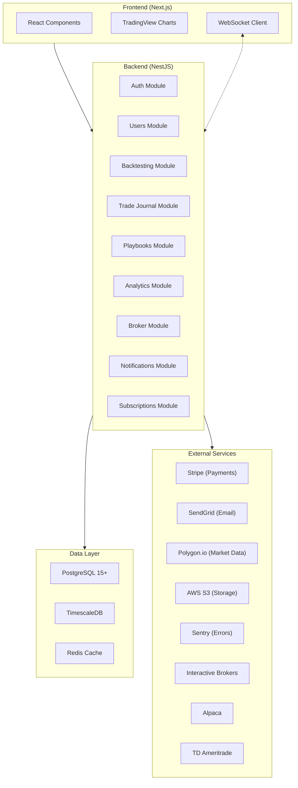
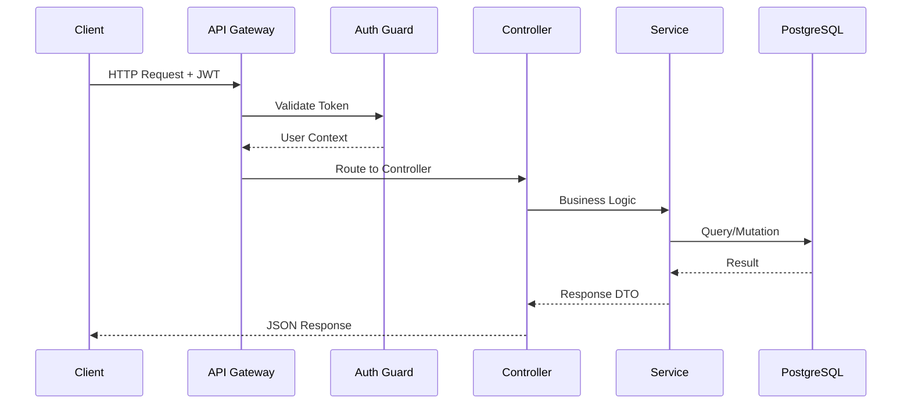
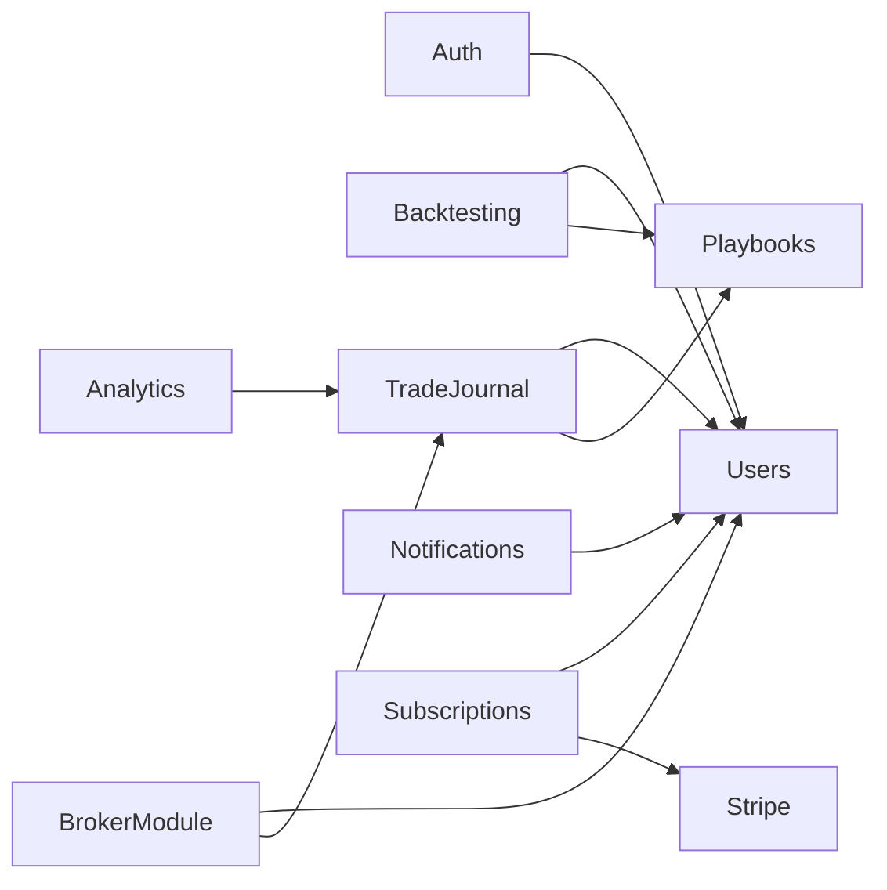

# Architecture Overview

## System Architecture



## Technology Stack

| Layer | Technology | Purpose |
|-------|-----------|---------|
| **Frontend** | Next.js + React + TypeScript | UI, routing, SSR |
| **Charting** | TradingView Lightweight Charts | Candlestick/line charts |
| **Backend** | NestJS + TypeScript | REST API, WebSocket |
| **ORM** | Prisma | Database access |
| **Database** | PostgreSQL 15+ | Primary data store |
| **Time-series** | TimescaleDB | Historical price data |
| **Cache** | Redis | Session cache, rate limiting |
| **Auth** | JWT + bcrypt | Authentication |
| **Payments** | Stripe | Subscriptions, checkout |
| **Email** | SendGrid | Transactional emails |
| **Market Data** | Polygon.io | OHLCV data, symbol search |
| **Storage** | AWS S3 | Screenshots, exports |
| **Monitoring** | Sentry + Prometheus + Grafana | Errors, metrics, dashboards |
| **CI/CD** | GitHub Actions | Build, test, deploy |
| **Infrastructure** | Kubernetes (AWS EKS) | Container orchestration |

## Request Flow



## Module Dependencies



## Data Flow

1. **User signs up** → Auth Module → Creates user record → Sends verification email
2. **Creates backtest session** → Backtesting Module → Fetches historical data from Polygon.io → Stores session
3. **Places trades** → Backtesting Module → Calculates P&L (DB trigger) → Updates balance
4. **Imports CSV** → Trade Journal Module → Parses CSV → Creates trade records → Auto-calculates P&L
5. **Broker sync** → Broker Module → Calls broker API → Maps trades → Imports to journal
6. **Views analytics** → Analytics Module → Queries materialized views → Returns metrics

## Directory Structure

```
backtesting/
├── backend/                    # Primary NestJS API
│   ├── src/
│   │   ├── auth/              # Authentication (JWT, guards, strategies)
│   │   ├── database/          # Database config and seeds
│   │   ├── prisma/            # Prisma service
│   │   └── main.ts            # Application entry point
│   ├── prisma/
│   │   └── schema.prisma      # Prisma schema
│   └── test/                  # E2E tests
├── trading-platform-backend/   # Extended backend
│   └── src/modules/
│       ├── auth/              # Auth module
│       └── users/             # Users module
├── trading-platform-frontend/  # Next.js frontend
│   ├── app/                   # App router pages
│   └── public/                # Static assets
├── database/
│   ├── schema/                # SQL migrations
│   ├── seeds/                 # Seed data
│   └── docs/                  # DB documentation
└── docs/                      # This documentation
```
