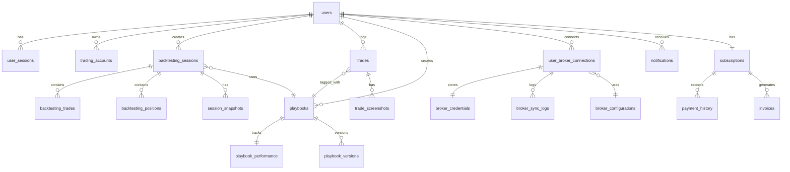

# Database Schema Documentation

Reference documentation for the Trading Platform database (PostgreSQL 15+ with TimescaleDB).

---

## Entity-Relationship Overview

---

## Custom Types (Enums)

| Type | Values |
|------|--------|
| `subscription_tier` | `free`, `pro`, `team`, `enterprise` |
| `subscription_status` | `active`, `canceled`, `expired`, `past_due` |
| `session_status` | `active`, `paused`, `completed`, `archived` |
| `trade_direction` | `long`, `short` |
| `asset_class` | `stock`, `forex`, `crypto`, `futures`, `options`, `index` |
| `trade_source` | `backtest`, `live`, `manual`, `imported` |

---

## Tables

### Users & Authentication

#### `users`
Primary user table.

| Column | Type | Constraints | Description |
|--------|------|------------|-------------|
| id | UUID | PK, auto-generated | Unique identifier |
| email | VARCHAR(255) | UNIQUE, NOT NULL | Login email |
| password_hash | VARCHAR(255) | NOT NULL | bcrypt hash |
| first_name | VARCHAR(100) | | Display name |
| last_name | VARCHAR(100) | | Display name |
| subscription_tier | subscription_tier | DEFAULT 'free' | Current plan |
| subscription_status | subscription_status | DEFAULT 'active' | Plan status |
| is_email_verified | BOOLEAN | DEFAULT false | Email verified? |
| two_factor_enabled | BOOLEAN | DEFAULT false | 2FA enabled? |
| preferences | JSONB | DEFAULT '{}' | User settings |
| created_at | TIMESTAMPTZ | auto | Creation time |
| updated_at | TIMESTAMPTZ | auto-trigger | Last update |
| last_login_at | TIMESTAMPTZ | | Last login |

#### `user_sessions`
Active login sessions for token management.

#### `password_reset_tokens`
Temporary tokens for password reset flow.

#### `email_verification_tokens`
Tokens for email verification.

### Trading Accounts

#### `trading_accounts`
Virtual or live trading accounts linked to a user.

| Column | Type | Description |
|--------|------|-------------|
| id | UUID | PK |
| user_id | UUID | FK → users |
| account_name | VARCHAR(255) | Display name |
| account_type | VARCHAR(50) | 'paper', 'live', 'demo' |
| starting_balance | DECIMAL(15,2) | Initial capital |
| current_balance | DECIMAL(15,2) | Current capital |
| currency | VARCHAR(3) | Default 'USD' |

### Backtesting

#### `backtesting_sessions`
Each backtesting session instance.

| Column | Type | Description |
|--------|------|-------------|
| id | UUID | PK |
| user_id | UUID | FK → users |
| session_name | VARCHAR(255) | User-defined name |
| instrument | VARCHAR(50) | Ticker symbol |
| asset_class | asset_class | Asset type enum |
| starting_balance | DECIMAL(15,2) | Initial capital |
| current_balance | DECIMAL(15,2) | Running balance |
| start_date / end_date | DATE | Data range |
| playbook_id | UUID | FK → playbooks (optional) |
| playback_speed | INTEGER | 1–10x speed |
| status | session_status | Session lifecycle |

#### `backtesting_trades`
Trades placed within a session.

#### `backtesting_positions`
Open/closed positions within a session.

#### `session_snapshots`
Point-in-time state captures.

### Trade Journal

#### `trades`
Central trade table for all sources.

| Key Columns | Type | Description |
|-------------|------|-------------|
| source | trade_source | backtest, live, manual, imported |
| instrument | VARCHAR(50) | Ticker symbol |
| direction | trade_direction | long / short |
| entry_price / exit_price | DECIMAL(15,8) | Trade prices |
| pnl_gross / pnl_net | DECIMAL(15,2) | Auto-calculated by trigger |
| pnl_percentage | DECIMAL(10,4) | Percentage return |
| risk_reward_ratio | DECIMAL(10,2) | R:R ratio |
| trade_duration_minutes | INTEGER | Auto-calculated |
| tags | JSONB | Array of tag strings |

#### `trade_screenshots`
Images attached to trades (stored in S3).

#### `trade_tags`
User-defined tags with categories and colors.

### Market Data (TimescaleDB)

#### `historical_prices` (Hypertable)
OHLCV candlestick data. Partitioned by week using TimescaleDB.

| Column | Type | Description |
|--------|------|-------------|
| symbol | VARCHAR(20) | Part of composite PK |
| timestamp | TIMESTAMPTZ | Part of composite PK |
| open/high/low/close | DECIMAL(15,8) | Price data |
| volume | BIGINT | Trade volume |
| timeframe | VARCHAR(10) | '1m','5m','15m','1h','4h','1d' |

#### `tick_data` (Hypertable)
Tick-level price data. Partitioned by day.

#### `symbols`
Instrument reference data.

### Materialized Views

#### `daily_performance`
Pre-aggregated daily metrics per user:
- Total trades, winning/losing counts
- Daily P&L, average P&L
- Largest win/loss, win rate

Refreshed via `REFRESH MATERIALIZED VIEW CONCURRENTLY daily_performance;`

### Database Triggers

| Trigger | Table | Function |
|---------|-------|----------|
| `update_*_updated_at` | Multiple | Sets `updated_at = NOW()` on UPDATE |
| `calculate_pnl_before_insert` | trades, backtesting_trades | Auto-calculates P&L fields |
| `calculate_pnl_before_update` | trades | Auto-recalculates on UPDATE |

### Extensions Required
- `uuid-ossp` — UUID generation
- `pgcrypto` — Cryptographic functions
- `timescaledb` — Time-series optimization
